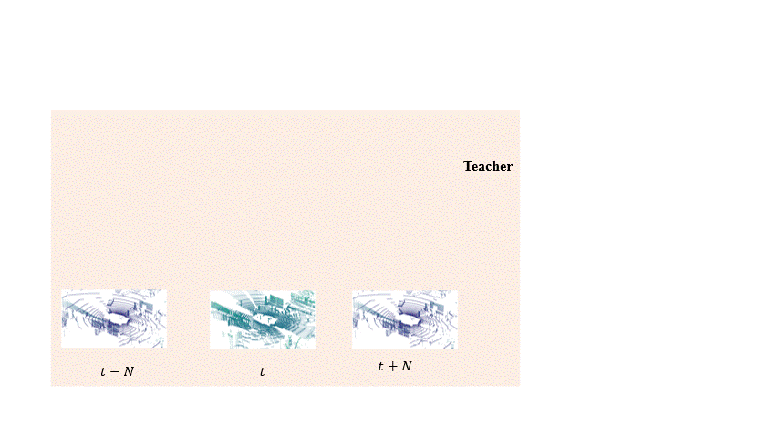

# Semi-supervised 3D Object Detection via Temporal Graph Neural Networks



This is the official repo of "Semi-supervised 3D Object Detection via Temporal Graph Neural Networks", 3DV 2022 <br/> \
Project page: <url>https://www.jianrenw.com/SOD-TGNN/</url> \
Paper: <url>https://arxiv.org/pdf/2202.00182.pdf</url>

## Setup environment
Follow [CenterNet](https://github.com/xingyizhou/CenterNet) to setup environment and install required packages

## Generate Pickle file
Follow [SECOND](https://github.com/traveller59/second.pytorch) to convert [h3d](https://usa.honda-ri.com/h3d)/[nuScenes](https://www.nuscenes.org/nuscenes) dataset to pickle file

## Run the training experiment
<pre>
python run_pipeline_h3d.py CONFIG_PATH --save_dir=SAVE_PATH --work_dir=WORK_DIR --data_path=UNLABLED_DATASET --h3d_data=LABLED_DATASET
</pre>

## Run the testing
<pre>
python -m torch.distributed.launch --nproc_per_node=4 ./tools/dist_test.py CONFIG_PATH --work_dir=work_dirs/CONFIG_NAME --checkpoint=work_dirs/CONFIG_NAME/latest.pth 
</pre>

## Acknowlegement
This project is not possible without multiple great opensourced codebases. We list some notable examples below.  

* [CenterNet](https://github.com/xingyizhou/CenterNet)
* [SECOND](https://github.com/traveller59/second.pytorch)

**SOD-TGNN is deeply influenced by the following projects. Please consider citing the relevant papers.**

```
@article{wang2021sodtgnn,
    title={Semi-supervised 3D Object Detection via Temporal Graph Neural Networks},
    author={Wang, Jianren and Gang, Haiming and Ancha, Siddharth and Chen, Yi-ting and Held, David},
    journal={International Conference on 3D Vision},
    year={2021}
}

@inproceedings{jianren20s3da,
    Author = {Wang, Jianren and Ancha, Siddharth and Chen, Yi-Ting and Held, David},
    Title = {Uncertainty-aware Self-supervised 3D Data Association},
    Booktitle = {IROS},
    Year = {2020}
}

